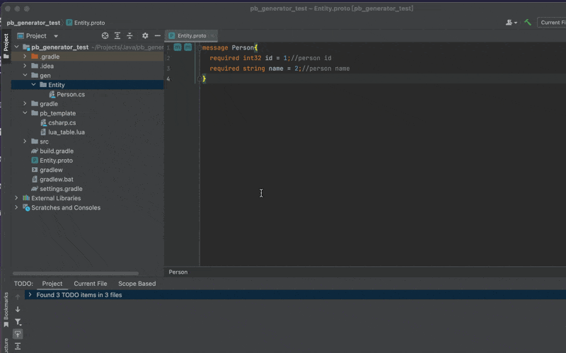
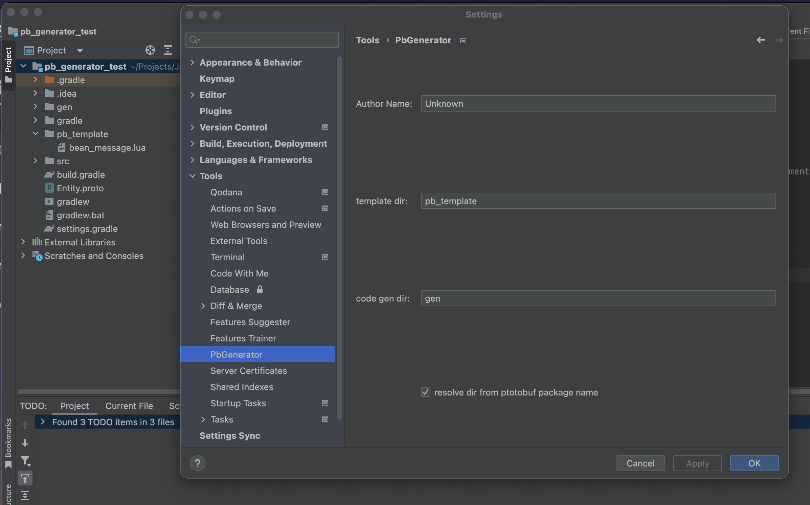
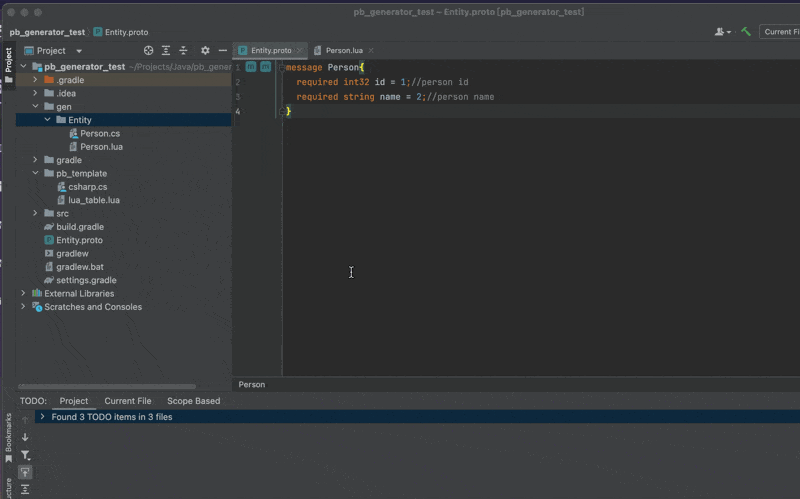

# pb_generator

## JetBrains Plugin for Protobuf Code Generation with Velocity

`pb_generator` 是一个 JetBrains 插件，用于通过 Velocity 模板生成 Protobuf 代码。




## 示例（Sample 1）:

Entity.proto:

```protobuf
message Person {
    required int32 id = 1; // person id
    required string name = 2; // person name
}
```

Velocity 模板文件:

```lua
--[[
@Author: $author
@Date: $date
@Description: TODO:
]]
## 定义一个宏来格式化输出
#macro(displayField $field)
    $field.name = $field.defaultValue,  -- pb_type: $field.type, pb_number: $field.number, pb_comment: $field.comment
#end
## 使用 foreach 指令来迭代字段列表
table $packageName.$messageName = {
#foreach( $field in $message.fields)
    #displayField($field)
#end
}
```
生成操作演示：


生成结果:

Person.lua:

```lua
--[[
@Author: Unknown
@Date: 2024-05-23
@Description: TODO:
]]
table Entity.Person = {
    id = 0,  -- pb_type: int32, pb_number: 1, pb_comment: person id
    name = "",  -- pb_type: string, pb_number: 2, pb_comment: person name
}
```

若文件已存在，变为对比操作：
