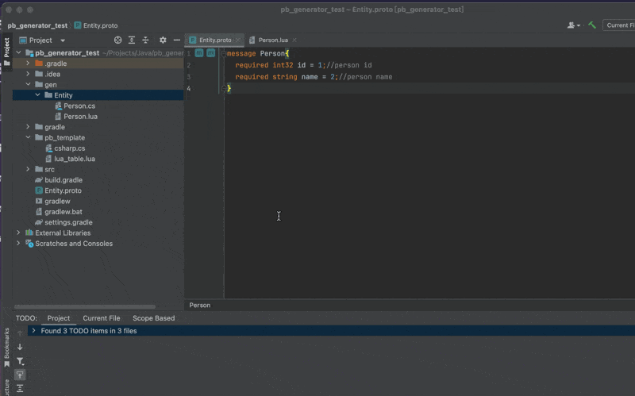

# Protobuf Code Generator
## 使用 Velocity 进行 Protobuf 代码生成


## 如何使用：
### 1. 准备一个 Protobuf 文件并编写一个消息：
Entity.proto:
```protobuf
message Person {
    required int32 id = 1; // 人员 ID
    required string name = 2; // 人员名称
}
```

### 2. 设计一个 Velocity 模板文件：
table.lua

```lua
--[[
@作者：$author
@日期：$date
@描述：TODO:
]]

## 定义一个宏来格式化输出
#macro(displayField $field)
    $field.name = $field.defaultValue,  -- pb_type: $field.type, pb_number: $field.number, pb_comment: $field.comment
#end
## 使用 foreach 指令遍历字段列表
table $packageName.$messageName = {
#foreach( $field in $message.fields)
    #displayField($field)
#end
}
```

### 3. 点击行标记以生成代码：


**生成结果**：

Person.lua：
生成的文件扩展名与模板文件的扩展名一致，文件名与消息名称匹配。

```lua
--[[
@作者：未知
@日期：2024-05-23
@描述：TODO:
]]
table Entity.Person = {
    id = 0,  -- pb_type: int32, pb_number: 1, pb_comment: 人员 ID
    name = "",  -- pb_type: string, pb_number: 2, pb_comment: 人员名称
}
```
### 如果文件已存在，则执行比较操作：


## 依赖
- **Protocol Buffers IntelliJ IDEs Plugin**
    - **插件链接**: [Protocol Buffers - IntelliJ IDEs Plugin](https://plugins.jetbrains.com/plugin/14004-protocol-buffers)
    - **版权**: © 2000-2024 JetBrains s.r.o.